# TALLER DISEÑO Y ESTRUCTURACIÓN DE APLICACIONES DISTRIBUIDAS EN INTERNET
A continuación, se explorará la arquitectura de las aplicaciones distribuidas, en especial, la arquitectura de  los servidores web y el protocolo http sobre el que están soportados.

## Autor
* **Juan Felipe Sánchez Pérez**

## Instalación y ejecución
### Prerequisitos

* Versión 1.8 de Java.
* Si no cuenta con tal versión para ejecutarla desde la consola, diríjase a un IDE como IntelliJ en donde puede descargar y usar una versión específica de java para el proyecto.

### Instalación y uso
1. Clonar el repositorio en la carpeta que desee. Para ello use el siguiente comando:
```
git clone https://github.com/juansanxz/Lab02-AREP.git
```  

2. Dirijase a su IDE y abra el proyecto, en este caso se estará haciendo el proceso con IntelliJ.
3. Ejecute la aplicación desde la clase HttpServer, que se encarga de administrar el servidor web.  
   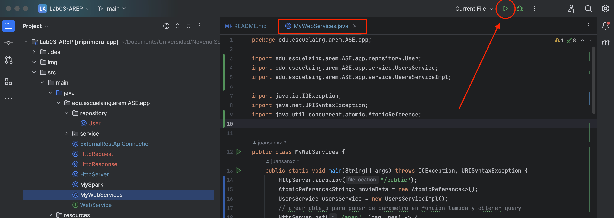  
4. Una vez ejecutada la aplicación, vaya a su browser de preferencia y dirijase a la siguiente URL para probar la aplicación web: `http://localhost:35000/cliente.html`.  
   En esta ocasión, yo lo haré con Chrome. Cuando esté allí, observará lo siguiente:  
   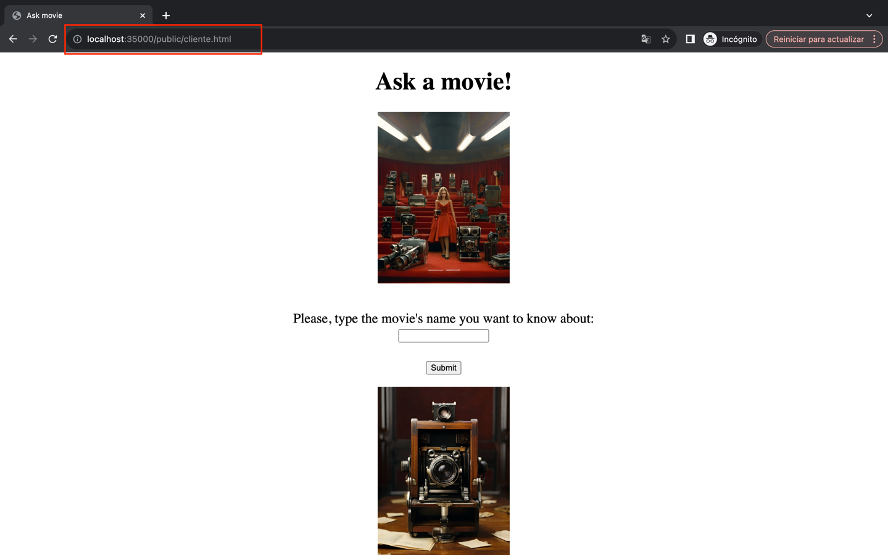  
5.  Tenga en cuenta que si intenta obtener otro recurso que no existe en el disco local, es decir, si en el path de la URL usa por ejemplo `http://localhost:35000/tareas.html`, se le devolverá un recurso que contiene lo siguiente:  
    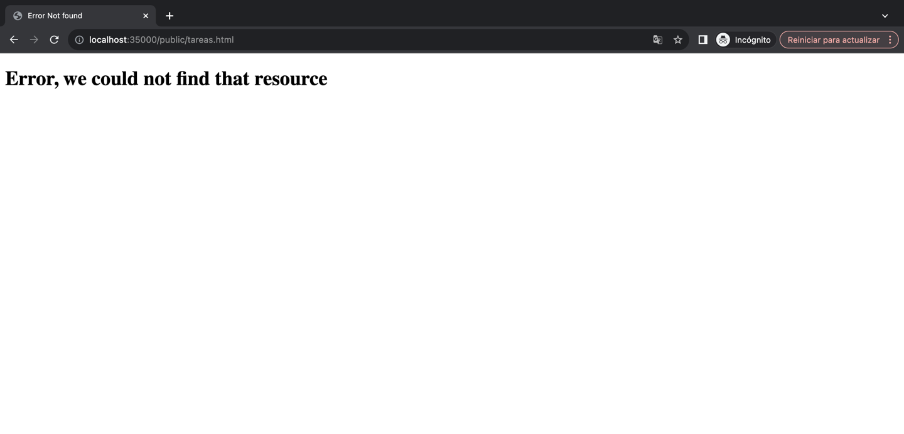  
6. Al igual que en el laboratorio anterior, puede digitar el nombre de la película que quiera consultar. En esta ocasión, se consultó _The silence of the lambs_:  
   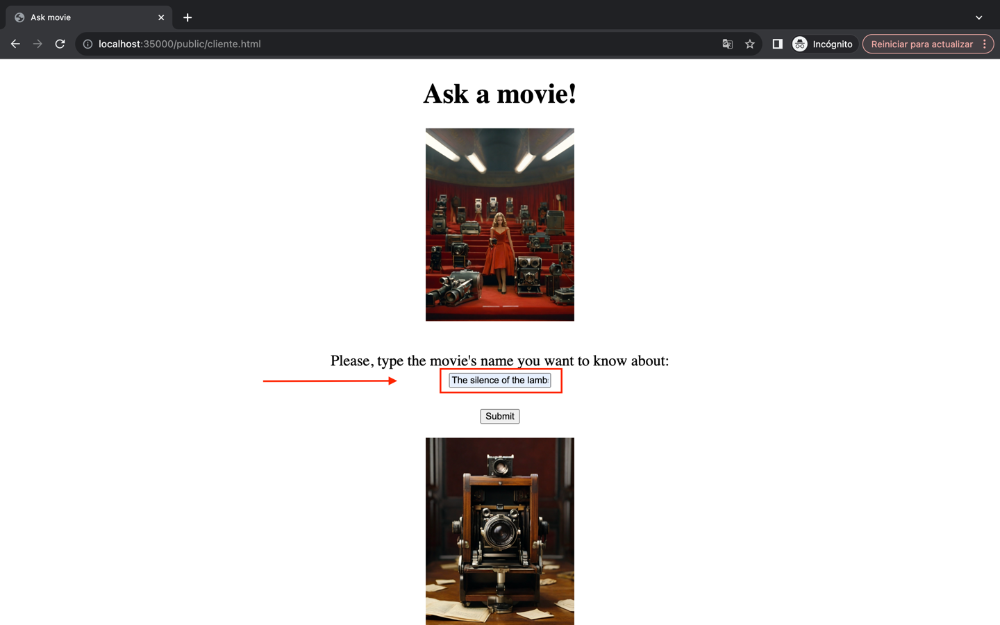  
7. Presione clic derecho (en Mac clic + control) y vaya a la opción de inspeccionar.  
  
8. Dirijase al apartado de _Network_.  
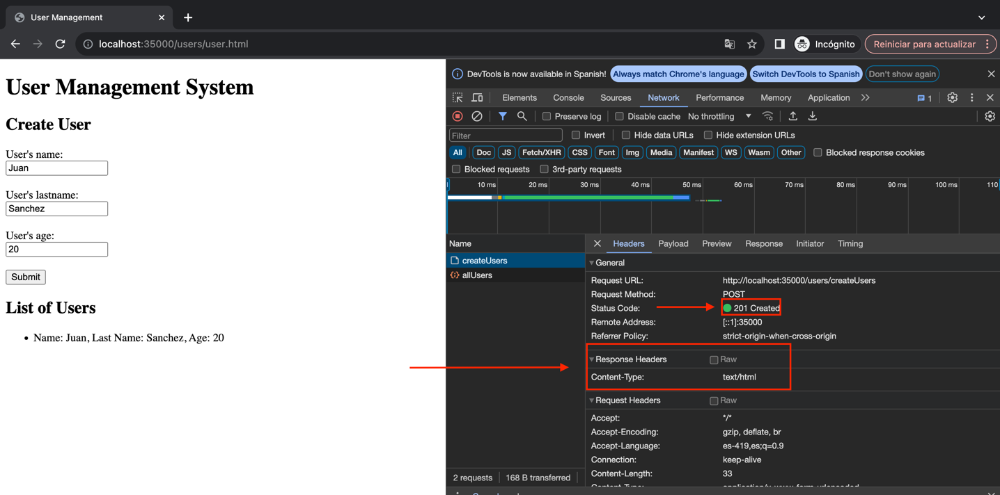  
9. Dar clic en el botón _Submit_, para obtener la información.  
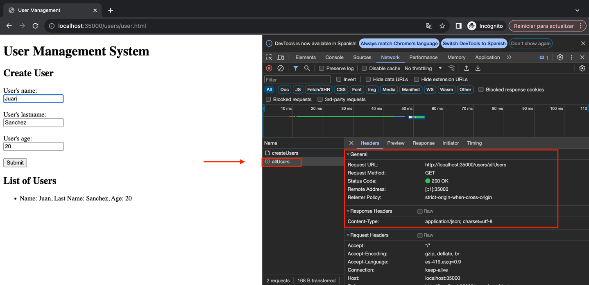  
10. Será redirigido a otra URL en la que se le mostrará de forma detallada la información de la película, y donde podrá visualizar la solicitud de los recursos requeridos por la aplicación.  
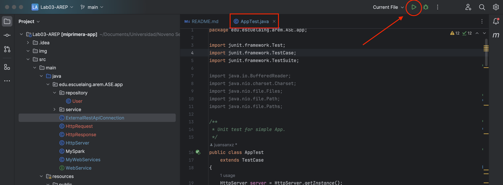

11. Si desea consultar otra película, haga clic para regresar y digite la película que desea.  
   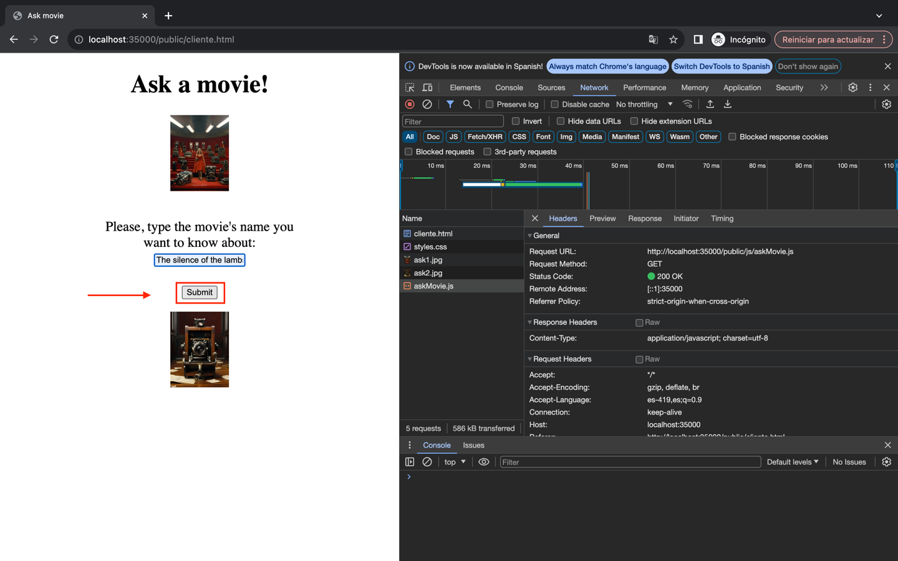  


## Ejecutando los tests
Para ejecutar los tests, puede hacerlo desde su IDE. En este caso, a través de IntelliJ, haciendo clic en la siguiente opción, desde la clase _AppTest.java_:    
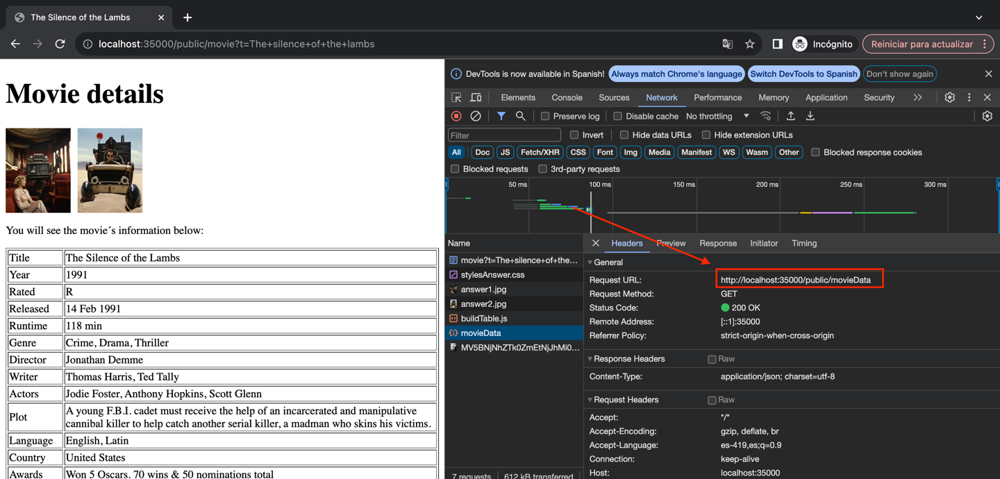  
Como vemos, se ejecutaron de forma exitosa:    
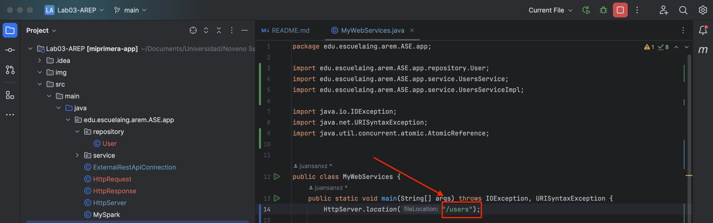  

### Tests

Para las pruebas unitarias, además de las que estaban desde el laboratorio pasado, que se encargan de probar el funcionamiento de la aplicación web, se añadió una en especial que comprueba que se esté cargando un archivo determinado desde el disco.  

La implementación de las pruebas se encuentra en el código.  

## Decisiones de diseño
La arquitectura que se diseñó e implementó para este laboratorio está compuesta por un servidor web, que interactúa con una aplicación web, entregándo los recursos que ésta última le pide a través del protocolo HTTP. A su vez, tal como en el laboratorio anterior, la aplicación web le solicita a una API externa información.  
* La clase `HttpServer.java` es quien se encarcarga de administrar el servidor web, atendiendo las peticiones HTTP, leyendo del disco los recursos y enviándolos oportunamente cuando le son solicitados.  
* El servidor web se encarga de analizar el path de la URI y determinar si el archivo que le solicitaron está en el disco local, e identifica la extensión de este para así mismo contruir un encabezado y responder las solicitudes HTTP correctamente. Por ejemplo, la aplicación web se compone de archivos js, css, HTML e imágenes, los cuáles se le piden al servidor web.  
  Si ejecutamos el servidor web y nos dirigimos a la URL `http://localhost:35000/cliente.html`, al inspeccionar las herramientas del desarrollador en el browser, si nos dirigimos al apartado de network, podemos observar los archivos específicos que componen a la aplicación y que fueron solicitados al servidor web mediante el protocolo HTTP:  
  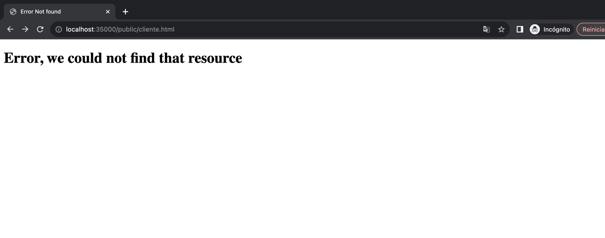  
* Seleccionando, por ejemplo, el archivo styles.css, vemos en el campo de headers, a quién se le hizo la petición, y el encabezado de la respuesta.  
  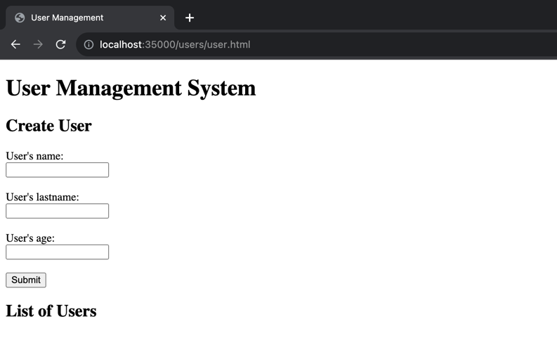  
* Podemos observar, de igual forma, al buscar una película determinada, que todos los archivos requeridos por la aplicación son consultados al servidor web.
  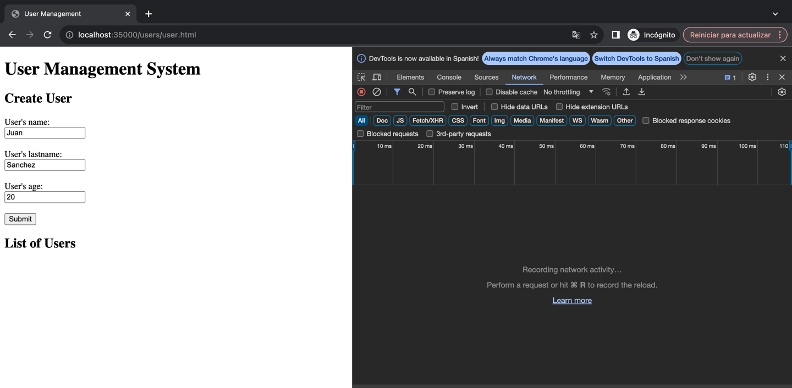  
* Se aplicó el principo de separación de responsabilidades, por lo que el servidor web simplemente tuvo como tarea la búsqueda en el disco local de los recursos que le eran solicitados, y la entrega de los mismos.  

## Build
* Maven - Administración de dependencias

## Versión
1.0


